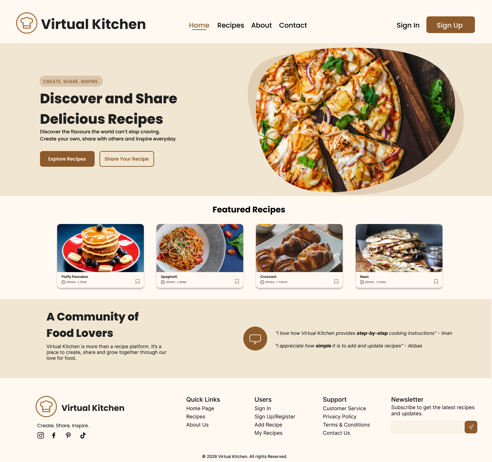

# Vitual Kitchen Revamp

A modern redesign of Virtual Kitchen focused on:
- better usability
- responsive layouts
- cleaner visual hierarchy
- improved accessibility

## Preview

## Figma
[Figma Prototype](https://www.figma.com/design/gukNZpLeweKu0EMEjGqgKB/Virtual-Kitchen-Revamp?node-id=0-1&t=jgi0863DgQ1Ekq3I-1)

## Improvements
- Simplified navigation
- Improved mobile responsiveness
- Consistent component system
